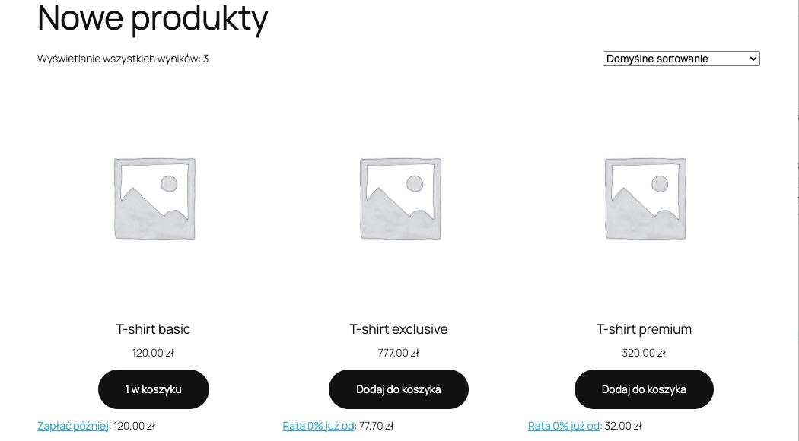
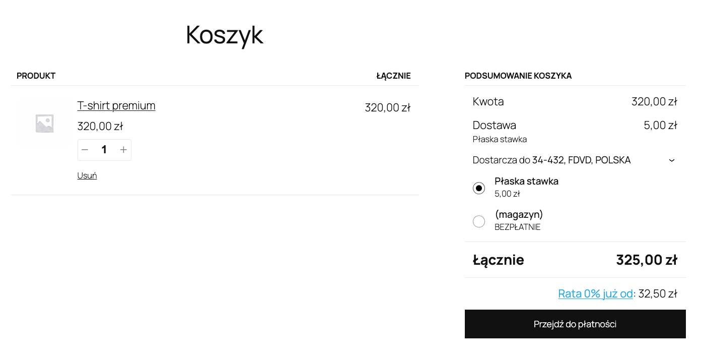
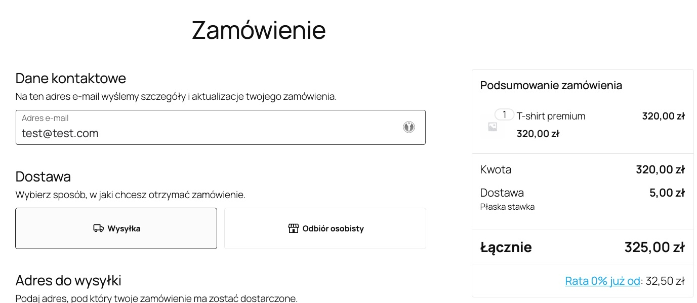

[**Wersja polska**][ext8]

# PayU Payment Module for WooCommerce

**If you have any questions or want to report a bug please [contact our technical support][ext13].**

## Requirements

**Note:** This module works only with `REST API` POS type.

If you do not have a PayU merchant account [**register a production account**][ext4] or [**register a sandbox account**][ext5]

The following PHP libraries are required: [cURL][ext1] and [hash][ext2].

## Installation
Use [automatic installation and activation](https://wordpress.org/support/article/managing-plugins/#automatic-plugin-installation) available in the Wordpress admin panel. Look out for `PayU GPO Payment for WooCommerce`.

## Payment methods
The plugin offers the following payment methods:

| Method                 |       Blocks       | Description                                                                                                                                             |
|------------------------|:------------------:|---------------------------------------------------------------------------------------------------------------------------------------------------------|
| PayU - standard        | :white_check_mark: | payer will be redirected to PayU's hosted payment page where any available payment type configured on your POS can be chosen                            |
| PayU - bank list       | :white_check_mark: | payment type list will be displayed, depending on chosen type the payer will be either redirected directly to the bank or to PayU's hosted payment page |
| PayU - payment card    | :white_check_mark: | payer will be redirected to PayU's hosted card form where credit, debit or prepaid card data can be securely entered                                    |
| PayU - secure form     | :white_check_mark: | a secure form collecting credit, debit or prepaid card data will be displayed                                                                           |
| PayU - Blik            | :white_check_mark: | payer will be redirected to Blik's page                                                                                                                 |
| PayU - installments    | :white_check_mark: | payer will be redirected to installment payment form                                                                                                    |
| PayU - Klarna          | :white_check_mark: | payer will be redirected to Klarna payment form                                                                                                         |
| PayU - Twisto          | :white_check_mark: | payer will be redirected to Twisto payment form                                                                                                         |
| PayU - Twisto pay in 3 | :white_check_mark: | payer will be redirected to Twisto pay in 3 payment form                                                                                                |
| PayU - PayPo           | :white_check_mark: | payer will be redirected to PayPo payment form                                                                                                          |
| PayU - PragmaPay       | :white_check_mark: | payer will be redirected to PragmaPay payment form (only for business clients)                                                                          |

#### Payment method remarks

* Methods `PayU - standard` and `PayU - bank list` enable payments of any type and differ only with the way the payment type is chosen. **Should not be configured both at once**.
* Methods `PayU - payment card` and `PayU - secure form` enable card payments and differ only with the way the card data is entered. **Should not be configured both at once**.
* In case `PayU - bank list` method is switched on, the following payment types are removed from the list: cards if `PayU - payment card` or `PayU - secure form` is on, Blik if  `PayU - Blik` is on, installments if `PayU - installments` is on, Klarna if `PayU - Klarna` is on, Twisto if `PayU - Twisto` is on, PayPo if `PayU - PayPo` is on, PragmaPay if `PayU - PragmaPay` is on.
* `PayU - secure form` method requires the shop to be available via HTTPS (for local tests, the address should be http://localhost)
* Even though  `PayU - payment card`, `PayU - secure form`, `PayU - Blik`, `PayU - installments`, `PayU - Klarna`, `PayU - Twisto`, `PayU - PayPo` and `PayU - PragmaPay` are on, they may be not visible in case they are not configured on your POS in PayU system or the amount is outside min-max range for the given payment type.

## Configuration
#### Global configuration
Global configuration is available in the main menu as `PayU Settings`

POS parameters:

| Parameter                       | Description                               |
|---------------------------------|-------------------------------------------|
| POS ID                          | POS (point of sale) ID in PayU system     |
| Second key MD5                  | Second key (MD5) in PayU system           |
| OAuth - client_id               | OAuth protocol - client_id in PayU system |
| OAuth - client_secret           | client_secret for OAuth in PayU system    |
| Sandbox - POS ID                | POS (point of sale) ID in Sandbox         |
| Sandbox - Second key MD5        | Second key (MD5) in Sandbox               |
| Sandbox - OAuth - client_id     | OAuth protocol - client_id in Sandbox     |
| Sandbox - OAuth - client_secret | client_secret for OAuth in Sandbox        |

* In case of using more than one currency, there will be a separate configuration for each available currency - more information in [Multicurrency](#multicurrency) section
* By default, each payment method uses global POS parameters

Other parameters - applicable to all modules:

| Parameter                                | Description                                                                                                                                                                                                                                                                                                                                                                                                                                          |
|------------------------------------------|------------------------------------------------------------------------------------------------------------------------------------------------------------------------------------------------------------------------------------------------------------------------------------------------------------------------------------------------------------------------------------------------------------------------------------------------------|
| Default order status                     | The status that the order will have after the payment process has started. Possible values  `On hold` or `Pending payment - pending`.<br/>According to the WooCommerce documentation, when warehouse management is enabled for `On hold` status, the number of products in the warehouse will be reduced and restored when the order changes to `Canceled` status, for `Pending payment - pending` status, the inventory levels will not be changed. |
| Order status for failed payment          | The status that an order will receive after an unsuccessful payment. Possible values `Canceled` or `Failed`. In the case of `Failed` it is possible for the buyer to retry the payment.                                                                                                                                                                                                                                                              |
| Enable retrieve status on Thank You page | On the Thank You page, when the payment does not have a final status, the status is checked cyclically (10 times every 4 seconds). If the status is `Failed`, the buyer can retry the payment.                                                                                                                                                                                                                                                       |
| Enable repayment                         | Allows the payer to try again payment regardless of status. Before using this option please check [Repayment](#repayment).                                                                                                                                                                                                                                                                                                                           |

#### Payment method configuration
Parameters available for every payment method:

| Parameter                  | Description                                                                                                                                                        |
|----------------------------|--------------------------------------------------------------------------------------------------------------------------------------------------------------------|
| Enable / Disable           | Enables payment method.                                                                                                                                            |
| Name                       | Name displayed during checkout.                                                                                                                                    |
| Sandbox mode               | If enabled, payments are done in Sandbox environment using Sandbox settings.                                                                                       |
| Use global settings        | If not enabled, you need to provide specific settings for given payment method.                                                                                    |
| Description                | Payment method description displayed during checkout.                                                                                                              |
| Enable for shipping method | Payment method may be enabled only for specific shipping methods. In case no shipping method is provided, the payment method is enabled for every shipping method. |
| Virtual orders             | Payment method will be enabled for virtual orders                                                                                                                  |

Parameters available for `PayU - bank list`:

| Parameter                     | Description                                                                                                                                                |
|-------------------------------|------------------------------------------------------------------------------------------------------------------------------------------------------------|
| Own ordering                  | To use your own ordering of payment types, you need to provide a comma-separated list of payment types codes from PayU system. [Payment types list][ext6]. |
| Show inactive payment methods | In case a given payment type is not active it is still displayed, but greyed out, otherwise not displayed.                                                 |

## Multicurrency
There are two ways to handle multicurrency:
### `WPML` Plugin
For every currency added to `WPML` plugin you can find separate point of sale configuration.
### Filters
The plugin provides two filters, that allow to add support for multiple currencies during payment

| Filter name                             | Description                                                   | Type  |
|-----------------------------------------|---------------------------------------------------------------|-------|
| `woocommerce_payu_multicurrency_active` | Should multicurrency service be enabled                       | bool  |
| `woocommerce_payu_get_currency_codes`   | List of currencies ISO codes in ISO 4217 standard e.g. "PLN". | array |

Example:
```php
function payu_activate_multicurrency($active)
{
    return true;
}

function payu_set_currency_list($currencies)
{
    return ['PLN', 'EUR'];
}

add_filter('woocommerce_payu_multicurrency_active', 'payu_activate_multicurrency');
add_filter('woocommerce_payu_get_currency_codes', 'payu_set_currency_list');
```

Notes:
*  When the `WPML` plugin is installed and filters are configured, the availability of currencies is checked in `WPML` then through the filters.
* Separate point of sale configurations are available when number of currencies is greater than 1.

## Filter hooks

### Change order status
| Filter Name                         | Description                              | Type   | Parameters |
|-------------------------------------|------------------------------------------|--------|------------|
| `woocommerce_payu_status_cancelled` | Order status for `CANCELED` notification | string | Order      |

## Repayment
This feature enables the payer to create a new payment for the same order if the previous payment was not successful.
To use the feature it is necessary to properly configure your POS in PayU, by disabling "Automatic collection" (it is enabled by default). This option is available in PayU panel. You need to go to Online payments then My shops and then POS. "Automatic collection is configured for every payment type, but to disable all at once you can use button at the very bottom, under the payment type list.

Repayment allows to create many payments in PayU for a single WooCommerce order. The plugin will automatically collect the first successful payment, all other will be canceled.
From user point of view, repayment is possible:
* by clicking a link in the order confirmation email
* by clicking "Pay with PayU" link in Actions column in order list
* by clicking "Pay with PayU" link over order details section

## Credit widget
Plugin provides seamless integration of [credit widget][ext14]. It's responsible for presenting minimal installment amount for a given product.
Additionally, after clicking on the widget, information on available repayment plans is presented, as well as a list of deferred payment methods (“buy now, pay later”).
Functionality is enabled by default. It can be deactivated in administration panel (WooCommerce->PayU settings).
Integration points of a widget have been described in a table below.

| Checkbox Installments widget | Description                                                                                                              | Presentation                                                                                             |
|------------------------------|--------------------------------------------------------------------------------------------------------------------------|----------------------------------------------------------------------------------------------------------|
| Enabled on product listings  | <div style="max-width:200px">Presents "installment from" widget on all product listings.</div>                           | <div style="max-width:500px"></div>      |
| Enabled on product page      | <div style="max-width:200px">Presents widget on product page.</div>                                                      | <div style="max-width:500px"></div>  |
| Enabled on cart page         | <div style="max-width:200px">Presents widget on cart page - relates to a total cart amount and shipping costs.</div>     | <div style="max-width:500px"></div>     |
| Enabled on checkout page     | <div style="max-width:200px">Presents widget on checkout page - relates to a total cart amount and shipping costs.</div> | <div style="max-width:500px"></div> |

Widget is presented only for supported currencies and only for products or carts, which amount is within the allowed amount range for installment or deferred payment methods.

Additionally, in the administration panel, it is possible to limit the types of payments to be displayed in the credit widget.

## Emails
The plugin does not send any additional emails and does not interfere with any mailing process.

In case repayment is configured, the mail confirming order placement is enhanced with information about the possibility to pay the order.

<!--external links:-->
[ext1]: http://php.net/manual/en/book.curl.php
[ext2]: http://php.net/manual/en/book.hash.php
[ext4]: https://poland.payu.com/commercial-offer/
[ext5]: https://secure.snd.payu.com/boarding/#/registerSandbox/?lang=en
[ext6]: https://developers.payu.com/europe/docs/get-started/integration-overview/references/#payment-methods-reference
[ext8]: README.PL.md
[ext13]: https://polandeng.support.payu.com/s/?language=en_US
[ext14]: https://developers.payu.com/europe/docs/payment-solutions/credit/installments/#credit-widget-installments